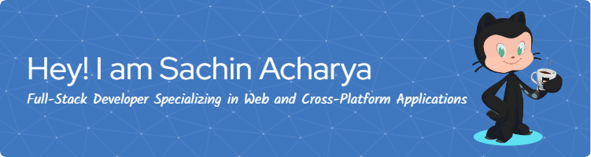

### Hi there 👋, I'm Sachin Acharya
Full-Stack Developer Specializing in Web and Cross-Platform Applications

I’m a full-stack developer with expertise in building dynamic web and cross-platform applications. Skilled in JavaScript (TypeScript), Python, and PHP, I work with modern frameworks like React, Next.js, React Native, and Flutter for front-end development. On the backend, I leverage Express, Flask, Django, and Laravel to create robust server-side solutions. I’m proficient with databases like Firebase, MongoDB, MySQL, and SQLite, and utilize cloud services such as AWS and Azure. With experience in Docker, GitHub Actions, and cloud hosting, I deliver end-to-end, scalable solutions across Windows and Linux environments.

I hold a degree in Computer Engineering, which has equipped me with a solid academic foundation and a deep understanding of computer systems, algorithms, and software development principles.

## 🔥 GitHub Stats & Contribution Streaks

    
    
    
    
    <!--  -->

## 🛠️ Technologies & Skills

    

        <strong>Programming Languages<strong>
    

    
<strong>Frameworks & Libraries</strong>

<!-- JavaScript Frameworks/Libraries -->

<!-- Backend Server -->

<!--TODO Hono.js -->

<!-- Cross-platform Stack -->

<!-- CSS Framework/Libraries -->

<!--  -->

<!-- JavaScript Frontend Libraries -->

    <strong>Databases</strong>

    <strong>Cloud & Hosting</strong>

    <strong>DevOps & Tools</strong>

    <strong>Operating Systems</strong>

    <strong>Cloud Hosting</strong>

    <strong>Web Server</strong>

    <strong>JavaScript Bundler</strong>

    <strong>Data Science & Machine Learning</strong>

    <strong>Others</strong>

## 🏅 Badges & Achievements

<!-- TODO Add More Badges -->

       

## 📬 Let's Connect!

You can reach out to me via email at [acharyaraj71@gmail.com](mailto:acharyaraj71@gmail.com) or connect with me on LinkedIn at [@sachin-acharya-projects](https://www.linkedin.com/in/sachin-acharya-projects/). I am open to new opportunities and collaborations, so feel free to get in touch!

Thank you for considering my profile. I look forward to discussing how I can contribute to your projects and goals.

Let's work together to build innovative and impactful applications!

<!-- TODO Changes to Better Images -->

> [acharyaraj71@gmail.com](mailto:acharyaraj71@gmail.com)  
> [www.sachinacharya.cf](https://www.sachinacharya.cf/)  
> [linkedin.com/in/sachin-acharya-projects/](https://www.linkedin.com/in/sachin-acharya-projects/)

###

  

###
